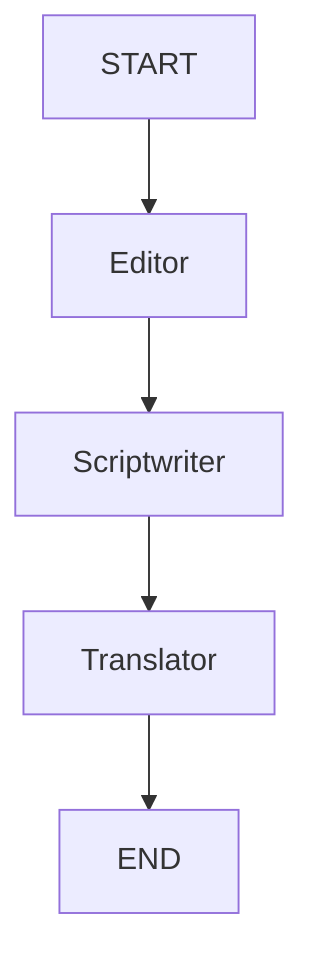

# LinxAI
An advanced multi-agent workflow built with LangGraph and LangChain that crafts, researches, and refines high-engaging LinkedIn posts. Running an iterative writer-reviewer feedback loop, it mimics an editorial team to ensure strict constraint adherence and a human-like tone.
# LinxAI - LangGraph Content Pipeline

LinxAI is an intelligent content transformation pipeline built using **LangGraph** and **Mistral AI**. It processes raw input text through a multi-stage graph to clean, format, and translate content dynamically.

## 🚀 Pipeline Flow
The workflow consists of three distinct stages orchestrated as a state graph:
1. **Editor Node**: Cleans up grammar, removes typos, and refines the tone while preserving the core message.
2. **Scriptwriter Node**: Converts the polished text into an engaging, structured script format with dialogue/scenes.
3. **Translator Node**: Translates the final script into a natural, flowing Hinglish format.



## 🛠️ Installation & Setup

1. **Clone the repository:**
   ```bash
   git clone https://github.com/Ayush148158/LinxAI.git
   cd LinxAI
   ```

2. **Create a virtual environment and install dependencies:**
   ```bash
   python3 -m venv .venv
   source .venv/bin/activate
   pip install -r requirements.txt
   ```

3. **Configure Environment Variables:**
   Create a `.env` file in the root directory and add your Mistral API Key:
   ```env
   MISTRAL_API_KEY=your_mistral_api_key_here
   ```

## 🏃 Run the Application
Execute the main script to run the pipeline:
```bash
python project.py
```
